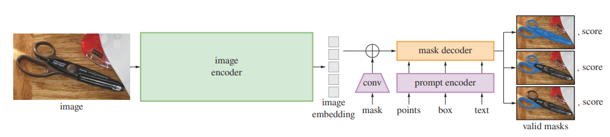

# Geo_Segmentation_SAM
Hello.

I've created this page that compiles a selection of helpful papers for my ongoing study on Pedestrian Infrastructure Segmentation. I often refer to these papers in my research. Please feel free to make use of them if they relate to your interests.

# Background:

## Problem:

While extensive research has been dedicated to the segmentation of road infrastructure in geographical imagery like aerial and satellite pictures, there has been notably less emphasis on pedestrian infrastructure, such as sidewalks and crosswalks, despite its significant importance in our daily lives. Therefore, accurately segmenting both road and pedestrian infrastructures could yield valuable insights into accessible pedestrian pathways and trip destinations. This segmentation capability can effectively turned into creating a full-scalable pedestrian network.

## Foundation Model (SAM):
Segment Anything Model (SAM) <a href="https://arxiv.org/abs/2304.02643">link</a> has been trained on an enormous dataset, of 11 million images and 1.1 billion masks, and it boasts impressive zero-shot performance on already a variety of segmentation tasks.
Foundation models such as this, which have shown promising advancements in NLP and, more recently, in computer vision, can carry out zero-shot learning. This means they can learn from new datasets and perform new tasks often by utilizing ’prompting’ techniques, even with little to no previous exposure to these tasks.
SAM’s ability to generalize across a wide range of objects and images makes it particularly appealing for Geographical Image applications.

# Table of Contents:
* <a href="#Geo">Geographical Image Segmentation Related</a>
* <a href="#SAMGeo">SAM-based Geographical Segmentation Related</a>
* <a href="#SAM">SAM-based approaches Related</a>
* <a href="#Others">Others Related</a>

## 
Geographical Image Segmentation Related 

* Mapping the Walk: A Scalable Computer Vision Approach for Generating Sidewalk Network Datasets from Aerial Imagery <a href="https://papers.ssrn.com/sol3/papers.cfm?abstract_id=4086624">paper</a>
* A Billion-scale Foundation Model for Remote Sensing Images <a href="https://arxiv.org/abs/2304.05215">paper</a>
## 
SAM-based Geographical Segmentation Related 

* The Segment Anything Model (SAM) for Remote Sensing Applications: From Zero to One Shot <a href="https://arxiv.org/abs/2306.16623">paper</a>
## 
SAM-based approaches Related 

* Personalize Segment Anything Model with One Shot <a href="https://arxiv.org/abs/2305.03048">paper</a>
## 
Others Related

* Segment Anything in Medical Images <a href="https://arxiv.org/abs/2304.12306">paper</a>
* On the Opportunities and Risks of Foundation Models <a href="https://arxiv.org/abs/2108.07258">paper</a>

